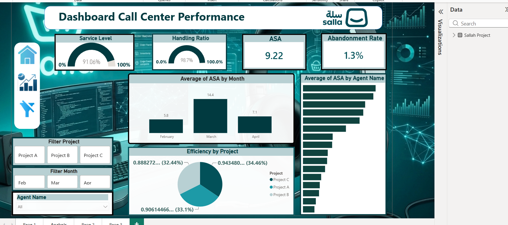

# مشروع تحليل أداء مركز الاتصال _لشركة سلة (Salla Call Center Performance Dashboard)

## نبذة عن المشروع
يقدم هذا المشروع لوحة تحكم تفاعلية وديناميكية لتحليل وقياس كفاءة أداء مركز الاتصال (Call Center) لمتجر إلكتروني يعمل على منصة **سلة (Salla)**. يهدف المشروع إلى مراقبة جودة الخدمة المقدمة للعملاء، ومتابعة سرعة الاستجابة للمكالمات، وتقييم كفاءة الموظفين (Agents) عبر مشاريع مختلفة (Project A, B, C) بهدف تقليل معدل المكالمات الفائتة وتحسين الأداء التشغيلي.

## الأدوات المستخدمة 
*   **Microsoft Excel**: لتجميع وفحص البيانات الخام لسجلات المكالمات الواردة.
*   **Power Query**: لتنظيف البيانات، وفصل التواريخ إلى شهور (February, March, April)، وتعديل صياغة النسب المئوية والمؤشرات.
*   **DAX (Data Analysis Expressions)**: لبناء المقاييس الذكية لحساب مؤشرات الأداء الحيوية الظاهرة في التقرير.
*   **Power BI Desktop**: لتصميم وبناء لوحة التحكم التفاعلية وتنسيقها بالألوان الرسمية لهوية سلة.
##خطوات العمل
1.  **استخراج البيانات وتنظيفها (ETL):** معالجة ملفات الإكسيل، والتأكد من صحة حساب أوقات الانتظار ونسب الرد على المكالمات.
2.  **كتابة معادلات DAX الحقيقية المستخدمة في التقرير:**
    *   **مستوى الخدمة (Service Level):** لقياس النسبة المئوية للمكالمات التي تم الرد عليها ضمن الإطار الزمني المحدد (محقق بنسبة واعدة تشرف على `91.06%`).
    *   **نسبة المعالجة (Handling Ratio):** لقياس النسبة الإجمالية للمكالمات التي تم التعامل معها بنجاح (محققة نسبة ممتازة `98.7%`).
    *   **متوسط سرعة الرد (ASA - Average Speed of Answer):** لحساب متوسط ثواني انتظار العميل حتى يرد الموظف (المتوسط العام `9.22` ثوانٍ).
    *   **معدل ترك المكالمات (Abandonment Rate):** قياس نسبة المكالمات الفائتة أو التي أغلقها العميل قبل الرد (نسبة منخفضة جداً وإيجابية `1.3%`).
3.  **التصور البصري والتفاعل (Data Visualization & Slicers):**
    *   إضافة فلاتر تفاعلية مرنة تتيح للمستخدم التصفية بناءً على اسم الموظف (**Agent Name**)، الشهر (**Filter Month**)، أو المشروع (**Filter Project**).
    *   مخطط عمودي لمراقبة تذبذب سرعة الرد عبر الأشهر (**Average of ASA by Month**).
    *   مخطط شريطي يقارن سرعة استجابة الموظفين وتحديد الأسرع بينهم (**Average of ASA by Agent Name**).
    *   مخطط دائري (Pie Chart) يوضح توزيع الكفاءة والإنتاجية بين المشاريع الثلاثة (**Efficiency by Project**).

## اهم النتائج و التوصيات 
*   **تحليل الشهور:** كان شهر مارس (March) هو الأعلى في متوسط وقت الانتظار وسرعة الرد بمعدل (`14.4`)، بينما شهد شهري فبراير وأبريل تحسناً ملحوظاً وانخفاضاً في وقت الانتظار، مما يشير إلى وجود ضغط مكالمات غير متوقع في مارس يتطلب دعم إضافي للفريق في الفترات المشابهة مستقبلاً.
*   **توزيع كفاءة المشاريع:** أظهر التحليل تقارباً كبيراً وتوازناً ممتازاً في الكفاءة بين المشاريع الثلاثة؛ حيث يمتلك **Project B** الكفاءة الأعلى بنسبة (`34.46%`)، يليه **Project A** بنسبة (`33.1%`)، ثم **Project C** بنسبة (`32.44%`).
*   **جودة الخدمة العامة:** يحقق المركز أداءً تشغيلياً ممتعاً ومستقراً جداً؛ حيث أن معدل ترك المكالمات (`1.3%`) يعتبر أقل بكثير من المعايير العالمية السلبية، مدعوماً بنسبة معالجة فائقة الذكاء تصل إلى (`98.7%`).

## لقطات من لوحة التحكم (Screenshots

